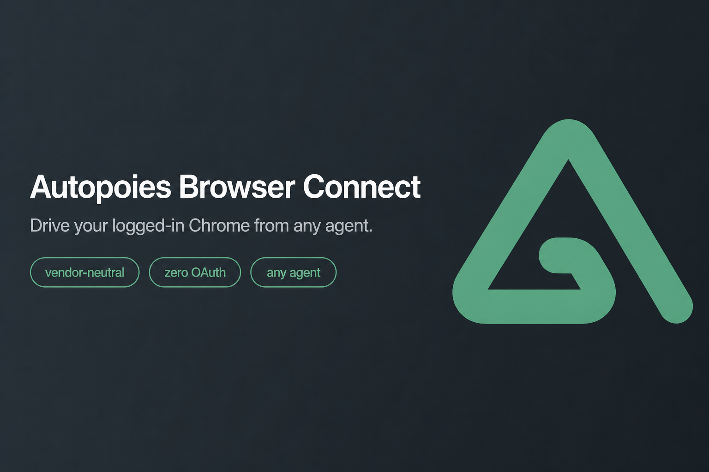
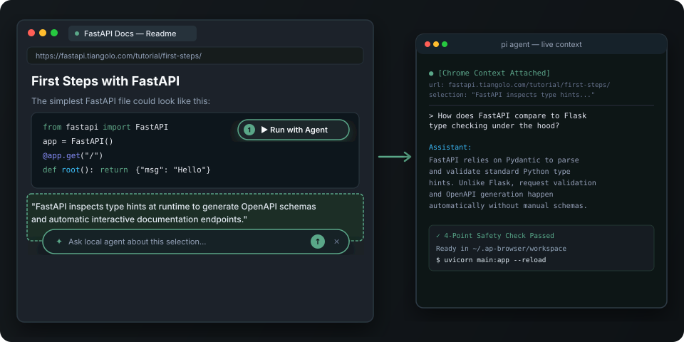
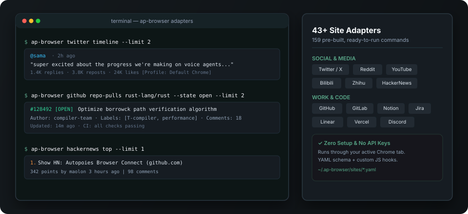
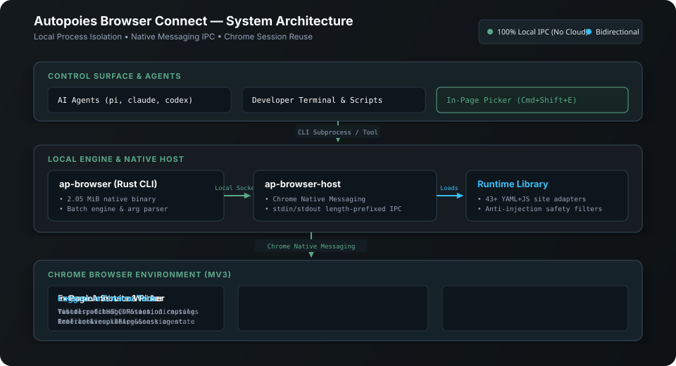

<div align="center">

[](LICENSE)
[](https://www.rust-lang.org/)
[](https://developer.chrome.com/docs/extensions/mv3/)
[](https://github.com/autopoies/ap-browser-connect)
[-yellow.svg)](https://github.com/autopoies/ap-browser-connect)

**Control your logged-in Chrome browser from local AI agents and terminal tools.**

[Features](#-key-features) • [In-Page Copilot](#1-️-mark-read--ask-in-page-agent-copilot-annotate) • [Site Adapters](#2--43-turnkey-site-adapters-adapters) • [Comparison](#️-why-ap-browser-connect) • [Quickstart](#-quickstart) • [Commands](#️-command-reference)

</div>

---

## ⚡ Measured Performance

| Metric | Measured Result |
| --- | --- |
| **Binary Footprint** | 2.05 MiB single executable (Rust). |
| **Memory Usage** | Peak CLI RSS: 4.3–5.3 MiB. Native host RSS: 2–3 MiB. |
| **Latency** | Single commands: 26–47 ms. Three-step batch: 80 ms. |
| **Agent Efficiency** | 1 tool call and ~2.3K tokens per steady-state adapter task. |

*Benchmarked on Apple Silicon macOS with Pi 0.84.1 and DeepSeek-V4-Flash 0731.*

---

## 🌟 Key Features

### 1. 🖊️ Mark, Read & Ask: In-Page Agent Copilot (`annotate`)

Bridge live web pages directly to your local terminal AI agents (`pi`, `claude`, `codex`, `cursor`, `opencode`).



* **Interactive In-Page Picker (`Cmd+Shift+E` / `Alt+Shift+E`)**:
  * **Hover & Pin**: Hover over any paragraph, table, or error message to inspect, or click to pin it.
  * **`✦ Ask <Agent>` Capsule**: Click to expand an inline prompt bar on selected text. Type your question and hit `Enter` to launch your local terminal agent with page context pre-attached.
  * **`▶ Run with <Agent>` Capsule**: Click any code block or terminal command (`npm install`, `curl | bash`) on documentation sites. The agent audits the command against safety rules and executes it in `~/.ap-browser/workspace`.
* **Visual Vision Grounding for Autonomous Agents**:
  * Agents call `ap-browser screenshot --annotate` to generate screenshots overlaid with numbered badges (`ref: 1`, `ref: 2`).
  * Maps visible elements to DOM references so agents can click and type accurately without guessing CSS selectors.

---

### 2. ⚡ 43+ Turnkey Site Adapters (`adapters`)

Automate popular web services without writing scrapers, reverse-engineering APIs, or handling 2FA. `ap-browser` executes structured commands directly through your active, authenticated browser profile:



```bash
# Social & Discussions
ap-browser twitter timeline --limit 20       # Read your logged-in timeline
ap-browser reddit subreddit rust --limit 10  # Fetch community posts
ap-browser hackernews top                    # Extract frontpage stories
ap-browser zhihu hot                         # Read trending topics

# Engineering & Workflows
ap-browser github repo-pulls rust-lang/rust  # Inspect pull requests
ap-browser jira my-tickets                   # Check assigned work items
ap-browser notion search "Roadmap"           # Search private workspaces

# Media & Search
ap-browser youtube search "Rust async"       # Query video search results
ap-browser bilibili hot                      # Extract trending videos
```

Adapters are clean YAML+JS definitions loaded at runtime from `~/.ap-browser/sites/`.  
Browse the library at [ap-browser-connect-adapters](https://github.com/autopoies/ap-browser-connect-adapters) or create your own with the [Adapter Guide](skill/references/create-site.md).

---

### 3. 🛡️ Site Filters (Anti-Injection & Privacy)

Untrusted webpage content can contain prompt injections. Site filters apply deterministic safety rules before text reaches your agent:

* **Omit nodes**: Strip ads, tracking scripts, and user comments from extraction.
* **Redact patterns**: Mask sensitive tokens and credentials from returned text.
* **Block actions**: Deny unsafe `click` or `fill` targets defined in filter policies (`~/.ap-browser/filters/`).

Read more in the [Safety Reference](skill/references/safety.md).

---

## ⚖️ Why ap-browser-connect?

| Feature | Headless Automation (Puppeteer / Playwright) | Standard Browser MCPs | ap-browser-connect |
| --- | --- | --- | --- |
| **Authentication** | ❌ Fails on 2FA / CAPTCHA / SSO | ⚠️ Flaky session persistence | ✅ **Uses your real, open Chrome profile** |
| **Human-in-the-Loop** | ❌ Headless / Invisible | ❌ Isolated tool window | ✅ **`Cmd+Shift+E` In-page visual copilot** |
| **Pre-built Site Actions** | ❌ Build every scraper from scratch | ❌ Raw DOM/click primitives only | ✅ **43+ sites & 159 commands ready** |
| **System Footprint** | ❌ Heavy Node.js + ~500 MiB Chromium | ❌ Node.js runtime daemon | ✅ **2 MiB Rust binary, <5 MiB RAM** |
| **Architecture** | ⚠️ Complex setup & dependencies | ⚠️ Cloud-routed or heavy local bridge | ✅ **100% Local Native Messaging IPC** |

---

## 🚀 Quickstart

### For AI Coding Agents

Paste this prompt into Claude Code, Cursor, Codex, or Pi:

```text
Install the skill with: npx skills add autopoies/ap-browser-connect/skill
Follow install.md to set up CLI, extension, native host manifest, and adapters.
Verify with: `ap-browser ping`
```

---

### For Humans

**1. Install the CLI and Native Host**

```bash
npm install -g ap-browser-connect
curl -fsSL https://raw.githubusercontent.com/autopoies/ap-browser-connect/main/install/install.sh | bash
```

*No npm? Download prebuilt binaries from [Releases](https://github.com/autopoies/ap-browser-connect/releases/latest).*

**2. Load the Chrome Extension**

1. Download and unzip `ap-browser-extension-*.zip` from [Releases](https://github.com/autopoies/ap-browser-connect/releases/latest) (e.g. to `~/ap-browser-extension/`).
2. Open `chrome://extensions/` in Chrome and enable **Developer mode** (top-right).
3. Click **Load unpacked** and select the unzipped directory.

**3. Install Site Adapters**

```bash
git clone https://github.com/autopoies/ap-browser-connect-adapters.git /tmp/abc-adapters
mkdir -p ~/.ap-browser
cp -R /tmp/abc-adapters/sites ~/.ap-browser/
cp -R /tmp/abc-adapters/filters ~/.ap-browser/
cp /tmp/abc-adapters/download-config.yml ~/.ap-browser/
```

**4. Verify Connection**

```bash
ap-browser ping
ap-browser hackernews top --limit 5
```

---

## 🛠️ Command Reference

The CLI provides a compact set of primitives for agents and scripts:

| Category | Primary Commands | Description |
| --- | --- | --- |
| **In-Page AI Copilot** | `Cmd+Shift+E`, `screenshot --annotate`, `state` | Highlight text/code to ask agent; visual ref overlay. |
| **Site Adapters** | `sites list`, `sites search <site>`, `<site> <cmd>` | Execute 159+ named actions across 43 platforms. |
| **Drive & Interact** | `goto`, `click`, `fill`, `press`, `wait`, `tabs` | Direct navigation and DOM interaction on active tabs. |
| **Batch Pipeline** | `batch` | Run multi-step JSON pipelines in one round-trip. |
| **Extract & Export** | `text`, `html`, `download`, `pdf`, `mhtml`, `har` | Session-aware downloads, exports, and text extraction. |
| **Dev & Debug** | `dev console`, `dev network`, `dev errors`, `dev perf` | Live Chrome DevTools Protocol debugging on active tabs. |

### Batch Execution Example

Reduce agent round-trips and token consumption by grouping commands into a single JSON batch:

```bash
echo '[
  {"method":"goto","url":"https://news.ycombinator.com"},
  {"method":"wait","selector":".athing"},
  {"method":"text"}
]' | ap-browser batch
```

*See [Pattern Guide](skill/references/patterns.md) and [Command Reference](skill/references/commands.md) for full syntax.*

---

## 🏗️ Architecture



1. **CLI (`ap-browser`)**: Lightweight Rust client handling user commands, adapter parsing, and batch pipelines.
2. **Native Host (`ap-browser-host`)**: Standard Chrome Native Messaging executable managing local IPC sockets without external network ports.
3. **Extension (MV3)**: Connects to target tabs to execute DOM, CDP, and visual overlay operations.
4. **Site Adapters (`~/.ap-browser/sites/`)**: Runtime YAML and JavaScript specs defining platform-specific extractors and actions.

---

## 🤝 Ecosystem & Contributing

* **Site Adapters**: Add support for new platforms in [ap-browser-connect-adapters](https://github.com/autopoies/ap-browser-connect-adapters).
* **Agent Skill**: Reference rules and tool integration in [`skill/`](./skill/).
* **Security & Multi-Profile**: See [Safety Policy](skill/references/safety.md) and [Multi-Profile Guide](skill/references/multi-profile.md).

---

## 📄 License

Apache-2.0
